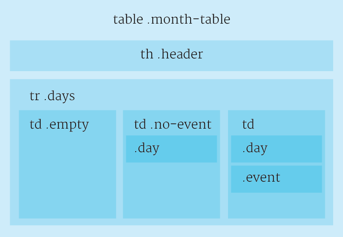

# OpenSUTD Community Calendar

## Inserting an Event

```
Start Date | End Date |  Name | Location | Link | Contact
```

Your dates should be in the `mm/dd/yyyy` format. If your day is multiple days, use both the Start and End Date columns, if it's just one day, leave End Date blank.

## Contributing to Styling

Included in this repository is a stylesheet for the calendar. Classes are like so:



## Acknowledgements

Based on a [fork-n-go Sheetsee.js](https://github.com/jlord/sheetsee-calendar) calendar project made by [@jlord](https://github.com/jlord) and [@muan](http://www.github.com/muan).

Original idea by [Qingze/@fishbiscuit](https://github.com/fishbiscuit) based on work done by Yiliang.
